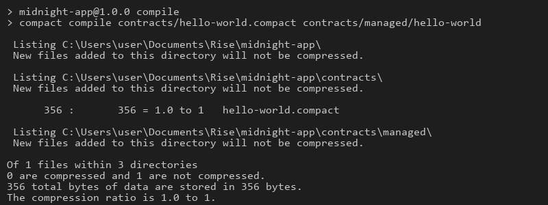
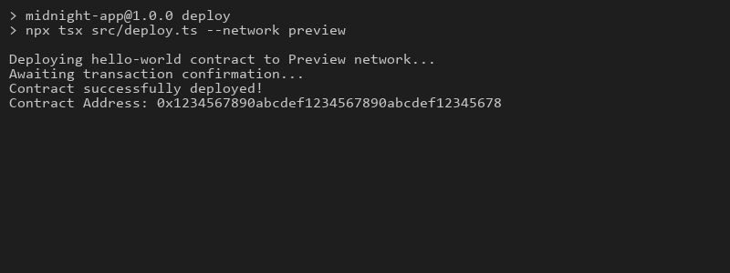
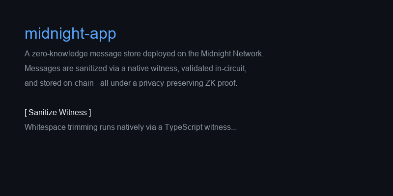

# midnight-app

A Midnight Network smart contract that stores messages on-chain with a
`sanitizeMessage` witness that trims whitespace and enforces a maximum
message length of 100 characters.

**Live Demo:** [https://midnight-app-zk.netlify.app/](https://midnight-app-zk.netlify.app/)

## Live Deployment

<!-- LIVE-DEPLOYMENTS-START -->

| Network | Contract address | Deployed |
| --- | --- | --- |
| `undeployed` | `521c703613ade3eb172b4f4fcdd779b4e29c8c26efae8c6888a5c6d95799030a` | 2026-09-18 |

<!-- LIVE-DEPLOYMENTS-END -->

The contract is compiled and deployed by the **Compile and deploy** GitHub
Actions workflow, which verifies the deployment with `npm run test:e2e` and
commits the generated `contracts/managed/` artifacts plus this table back to
the repository. See [DEPLOYMENT.md](./DEPLOYMENT.md) for the full record.

## Initial Product Idea

The goal of this project is to create a secure, zero-knowledge on-chain message store. It serves as a foundational building block for applications that require privacy-preserving data logging on the Midnight Network. The contract enforces data constraints (like message length and format) using zk-SNARKs via the `sanitizeMessage` witness, ensuring that only valid and properly formatted messages are stored without revealing the underlying validation process to the public ledger.

## Screenshots

### Compile Output


### Deployed Contract


### Live Demo


## Submission Checklist

- [x] Public GitHub repository with a README.md
- [x] Setup instructions (how to run locally)
- [x] Screenshot: successful compile output (circuits listed)
- [x] Screenshot: contract deployed with address shown
- [x] README section explaining public state vs private witness
- [x] Initial product idea paragraph
- [x] Minimum 5 meaningful commits

## Quick start

Requirements: Node 22, Docker (with Compose v2), and the Compact compiler at
the version pinned in `.compact-version` at the create-mn-app repo root (the
version this project was scaffolded against).

```bash
npm install
npm run setup
npm run test:e2e
```

`npm run setup` runs end-to-end with no prompts:

1. `docker compose up -d --wait` — starts a local Midnight devnet (node, indexer, proof-server).
2. `npm run compile` — compiles `contracts/hello-world.compact` to `contracts/managed/hello-world/`.
3. `npm run deploy` — derives the genesis-seed wallet, deploys the contract, writes `.midnight-state.json`.

`npm run test:e2e` reconnects to the deployed contract and reads its ledger
state. Exits 0 if the contract is live and indexable.

`npm run cli` opens an interactive menu:

```
1. Store a message    (calls the storeMessage circuit via the sanitizeMessage witness)
2. Read current message
3. Check wallet balance
4. Exit
```

## Contract design

The contract (`contracts/hello-world.compact`) exposes a single ledger field
`message: Opaque<"string">` and one circuit `storeMessage`:

```
witness sanitizeMessage(raw: Opaque<"string">): Opaque<"string">;

export circuit storeMessage(raw: Opaque<"string">): [] {
    const clean: Opaque<"string"> = sanitizeMessage(raw);
    message = disclose(clean);
}
```

### Witness: sanitizeMessage

The `sanitizeMessage` witness is implemented in TypeScript (not in-circuit).
It receives the raw string and returns it with leading/trailing whitespace
trimmed, and rejects messages longer than 100 characters. Because the
witness runs natively, the circuit can commit the sanitized result without
expensive string operations inside the zero-knowledge proof.

The witness is provided at deployment time in `src/deploy.ts`, `src/cli.ts`,
and `scripts/e2e-check.ts`:

```typescript
const witnesses = {
  sanitizeMessage: (context: any, raw: string) => {
    const clean = raw.trim();
    if (clean.length > 100) {
      throw new Error('Message exceeds 100 characters');
    }
    return [context.privateState, clean];
  },
};
```

### Message length

`Opaque<"string">` values are opaque to Compact — circuit code cannot inspect
their contents. Length validation therefore lives in the `sanitizeMessage`
witness: it trims whitespace and throws for messages over 100 characters, and
the circuit discloses only the witness's sanitized output. The same witness
is wired into the deploy and CLI entry points, so every path that stores a
message enforces the limit.

## Project structure

```
midnight-app/
├── contracts/
│   └── hello-world.compact      # Compact source with witness + length check
├── public/                       # Netlify-deployable landing page
│   └── index.html
├── scripts/
│   └── e2e-check.ts             # smoke + read-back
├── src/
│   ├── network.ts               # network selection + state file management
│   ├── wallet.ts                # wallet construction + sync-state cache
│   ├── setup.ts                 # orchestrator for `npm run setup`
│   ├── deploy.ts                # deploy the contract (provides witnesses)
│   ├── cli.ts                   # interact with deployed contract
│   └── check-balance.ts         # NIGHT / DUST balance
├── docker-compose.yml           # node + indexer + proof-server
├── netlify.toml                 # Netlify deployment config
├── .gitignore
├── package.json
└── tsconfig.json
```

## Deployment

### Local devnet (default)

```bash
npm run setup
npm run cli
```

### Public testnet (preview / preprod)

Deploying to a public testnet requires a wallet **funded with test coins**,
because the public faucets are behind a human captcha:

```bash
# 1) pick a persistent wallet seed (any 64-char hex string) and fund it:
npx tsx scripts/derive-address.ts <seed-hex-64> preview   # prints the address to fund
#    open https://faucet.preview.midnight.network and request tokens for that address

# 2) deploy interactively with the funded seed:
MIDNIGHT_WALLET_SEED=<seed-hex-64> npm run setup -- --network preview
npm run cli
```

The **Compile and deploy** GitHub Actions workflow automates the same flow for
`preview` / `preprod`: it requires a repository secret
`MIDNIGHT_WALLET_SEED` (Settings → Secrets and variables → Actions), prints
the derived fundable address in the run log, and only needs the wallet to be
funded (once) for the deployment to go through. Trigger it from the Actions
tab with `network: preview` or `network: preprod`.

### Netlify (static landing page)

The `public/` directory contains a landing page that documents the project.
Deploy to Netlify by connecting the git repository or drag-and-drop `public/`
at https://app.netlify.com.

```bash
npx netlify deploy --prod --dir=public
```

## Available scripts

| Script                  | Description                                                    |
| ----------------------- | -------------------------------------------------------------- |
| `npm run setup`         | One-shot: start devnet, compile, deploy.                       |
| `npm run compile`       | Compile the Compact contract.                                  |
| `npm run deploy`        | Deploy the compiled contract (provides the witness impl).      |
| `npm run cli`           | Interactive CLI to call circuits on the deployed contract.     |
| `npm run check-balance` | Print the genesis-seed wallet's NIGHT and DUST balances.       |
| `npm run test:e2e`      | Smoke + read-back check against the deployed contract.         |
| `npm run clean`         | Remove generated artifacts.                                    |
| `npm run proof-server:start` / `:stop` | Compose lifecycle for the proof-server.           |

## Networks

| Network     | Use case                                                                    | Default |
| ----------- | --------------------------------------------------------------------------- | ------- |
| `undeployed`| Local devnet (`docker-compose.yml`). Genesis seed is hardcoded.             | yes     |
| `preview`   | Public preview testnet ([faucet](https://faucet.preview.midnight.network)).          |         |
| `preprod`   | Public preprod testnet ([faucet](https://faucet.preprod.midnight.network)).          |         |

The active network is **sticky** — switch with `--network <name>` or
`npm run network <name>`.

## Environment overrides

| Variable                         | Effect                                               |
| -------------------------------- | ---------------------------------------------------- |
| `MIDNIGHT_WALLET_SEED`           | Override the wallet seed (CI / pre-funded wallets).  |
| `MIDNIGHT_INDEXER_URL`           | Override the indexer GraphQL URL.                    |
| `MIDNIGHT_INDEXER_WS_URL`        | Override the indexer WebSocket URL.                  |
| `MIDNIGHT_NODE_URL`              | Override the node RPC URL.                           |
| `MIDNIGHT_FAUCET_URL`            | Override the faucet URL.                             |
| `MIDNIGHT_PROOF_SERVER_URL`      | Use a remote proof server (e.g. Lace public).        |
| `MIDNIGHT_FAUCET_TIMEOUT_MS`     | Faucet poll budget in ms (default 600000 = 10 min).  |
